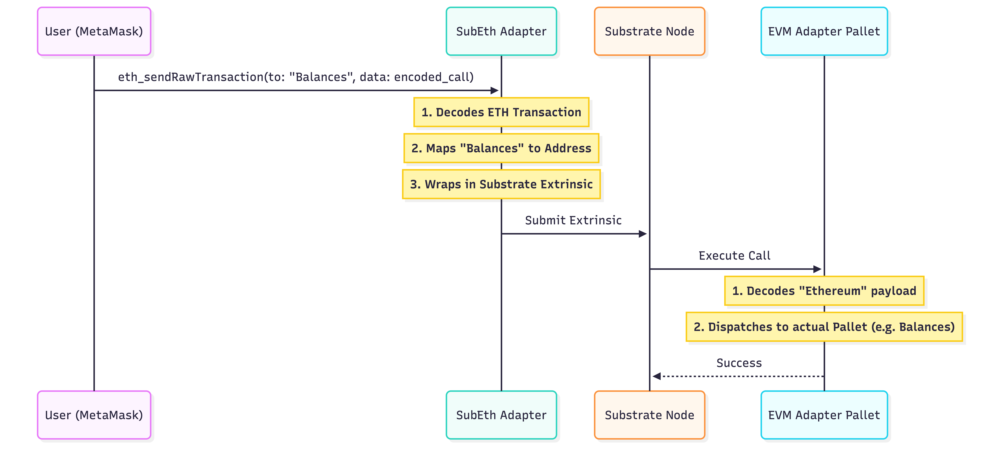

# SubEth: Bridging Ethereum Tools to Substrate Chains

## The Problem

The Polkadot ecosystem is powerful, but for developers coming from Ethereum, the learning curve can be steep. They have to leave behind their favorite tools like MetaMask, Hardhat, and Ethers.js because Substrate uses a completely different RPC standard and transaction format. What if you could use standard Ethereum tools to interact directly with a native Substrate chain, without a full EVM implementation like Frontier?

## The Solution

**SubEth** is a lightweight compatibility layer that bridges this gap. It consists of two main components:
1.  **The Adapter (`subeth`)**: A standalone RPC server that speaks "Ethereum" to your wallet and "Substrate" to your node.
2.  **The Pallet (`pallet-evm-adapter`)**: A runtime module that understands these translated transactions and executes them as native Substrate calls.

Unlike full EVM solutions, SubEth doesn't run an EVM inside your runtime. Instead, it maps Ethereum transactions directly to Substrate pallet calls. This means you can use MetaMask to call `Balances::transfer` or any other pallet function!

## How It Works

The magic happens in the translation layer. Here is the high-level flow:



### 1. The Adapter: The Translator

The adapter sits between your Ethereum tool and the Substrate node. When you send a transaction, the adapter intercepts it. It doesn't just forward bytes; it understands them.

It uses a "Light Client" approach (powered by `subxt`) to fetch metadata from the chain, so it knows exactly how to construct valid Substrate extrinsics.

**Pseudocode: Handling a Transaction**

```rust
fn handle_eth_tx(tx: EthTransaction) {
    // 1. Decode the "to" address to find the target Pallet
    let pallet_name = lookup_pallet_name(tx.to); 
    // e.g., 0x... -> "Balances"

    // 2. The 'data' field contains the SCALE encoded call
    let call_data = tx.data;

    // 3. Construct unsigned extrinsic
    let extrinsic = SubstrateExtrinsic {
        signature: sign_with_adapter_key(tx), // or user signature mapping
        call: Call::EvmAdapter(
            // We wrap the original ETH tx so the runtime can verify the signer
            original_tx: tx 
        )
    };

    // 4. Submit to Node
    node_client.submit(extrinsic).await;
}
```

### 2. The Pallet: The Executor

On the runtime side, the `pallet-evm-adapter` receives this special call. Its job is to unwrap the Ethereum transaction, verify the signature (recovering the Ethereum address), and then dispatch the actual call to the target pallet.

**Pseudocode: Dispatching the Call**

```rust
fn transact(origin, transaction: EthTransaction) {
    // 1. Verify signature and recover signer
    let signer_eth_address = transaction.recover_signer()?;
    
    // 2. Map ETH address to Substrate AccountId
    let who = map_to_account_id(signer_eth_address);

    // 3. Decode the destination
    let target_pallet = decode_pallet_name(transaction.to);

    // 4. Dispatch the call
    if target_pallet == "Balances" {
        // The 'data' is decoded as arguments for transfer
        let (dest, amount) = decode_args(transaction.data);
        Balances::transfer(who, dest, amount)?;
    } else {
        // Generic dispatch
        dispatch_call(who, target_pallet, transaction.data)?;
    }
}
```

### 3. Pallet Addressing: The Clever Trick

How do we tell MetaMask to call the "Balances" pallet? Ethereum transactions expect a 20-byte address, not a string.

SubEth uses a deterministic mapping:
- **"Balances"** -> `0x42616c616e636573000000000000000000000000` (Hex encoding of the string, padded)

So when you send ETH to this address in MetaMask, the Adapter knows you really mean to talk to the Balances pallet.

## Technical Highlights

### Address Mapping
We need a way to represent Ethereum users (`H160`) on Substrate (`AccountId32`). We use a hashing scheme:
`AccountId = Blake2_256(EthereumAddress)`

This ensures every Ethereum user has a unique, deterministic Substrate account.

### Zero-Config Metadata
The adapter fetches the runtime metadata automatically. This means if you upgrade your runtime to add a new pallet, the adapter instantly knows about it without recompilation.

## Conclusion

SubEth opens the door for a hybrid future. You can build specialized Substrate chains with custom logic, while still allowing users to onboard with the wallets they already know and love. It's not about replacing Substrate tools, but about expanding the ecosystem's reach.

**Explore the Code:** [github.com/element36-io/subeth](https://github.com/element36-io/subeth)
